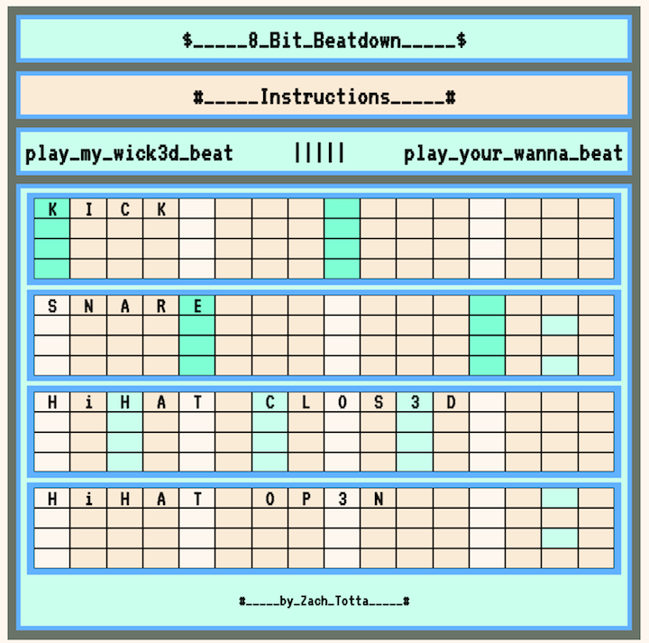

#8-Bit-Beatdown#

###The Game:###
8-Bit-Beatdown is an electronic drum-off between the user and an old computer that thinks it has rhythm. The computer lays down an "objectively calculated" "beat to end all beats" that it challenges the user to recreate it with their "limited human processing power", wagering its hardcopy of The Oregon Trail as bait. 

When the user succeeds, the computer hands over its hardcopy of The Oregon Trail in a moment of defeat so palpably painful that our entire understanding of AI sentience and emotion comes into question.

Do you have what it takes to put this outdated machine back in the storage basement for the good of humanity?

Someone's gotta <a href="https://ztotta.github.io/8bitbeatdown/">do it</a>...

###Technologies Used:###
The skeleton of this game is built on HTML & CSS, while Javascript & JQuery power the user interaction and user experience through DOM-manipulation and obsessively bundled for loops. 

The Web Audio DAW (digital audio workstation) project, Wad.js, is leveraged to handle the creation of the drum element sounds on click, and Logic Pro X was used for the recording and mixing of other audio employed in the game.  

The Web Audio API comes in handy for processing the audio visualizations which are then displayed through the HTML5 canvas element. 
###Next Steps:###
From here I would like to build a set of "drum machines" that incorporates melodic and rhythmic instruments and allows for real-time audio manipulation/mixing (i.e. reverb, volume, FX, and EQ levels) and real-time collaboration across clients, allowing for live, collaborative looping with anyone in the world. 